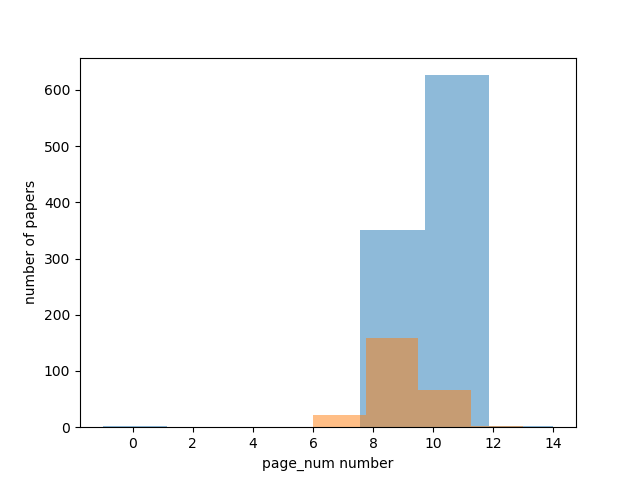

# Paper Gestalt 
**论文颜值分析**
***
这是移动互联网课程大作业**论文颜值分析**的cv部分，主要是基于[1](#refer-anchor-1)以及其实现[2](#refer-anchor-2)还有学校Acemap这块的工作[3](#refer-anchor-3)。大作业的其余部分（nlp以及网站搭建）见[https://github.com/david990917/Appearance-analysis-of-the-paper](https://github.com/david990917/Appearance-analysis-of-the-paper)。

## 做了哪些事情
* 验证 *颜值* 分类的可行性
* 复现论文中的打分和热图方法
* 显式提取论文特征用来分类（来源于[2](#refer-anchor-2)）
* 运用知识蒸馏提升模型效果
***

### 统计视觉特征数量分布
首先是根据前面的研究，确定视觉特征主要来源于图片、表格、公式、页数等，于是统计了这些指标在正负论文样本之间的分布，发现真的有差别。

<!-- 

 -->
这为用CNN来学习分类器以及显式提取特征提供了理论依据。

### 方法复现
除了论文的方法，我们还考虑为单独的一页学习分类器而不是整篇论文，从而避免丢弃掉多余的页面而损失信息。不过效果其实不好，可能是因为将整篇论文的标签赋予一个单独的页面过于粗略，所以其实并没有意义。

### 显式提取论文特征
显式的意思是直接统计论文每页的图表公式以及整篇的页数作为一个多维向量，然后就成了一个简单的二分类问题。基于我们前门统计的数量分布，应该说这种分类效果是不错的，事实上我们将这种分类的评分与CNN直接学习和推理的评分（评分就是标签1的softmax值，即预测是好论文的概率），比单独的CNN的准确率提高了很多。

### 运用知识蒸馏提升模型效果
知识蒸馏其实可以很复杂，比如在目标检测中提升Faster R-CNN模型的效果[3](#refer-anchor-3)，不过我们就是考虑简单地用VGG-19的softmax层来替代0/1标签训练resnet-18。其实后者在原论文中本身表现就很好了，提升空间不大。当然在具体代码实现上要把分类网络替换成回归网络也挺麻烦的，我们并没深入。

### 总结
u1s1这纯炼丹，自己没学到太多新东西😢。其实可以做疫情汇总网站的，选题的时候太划水了qaq。

***

## 本仓库的使用方式
可以使用[2](#refer-anchor-2)中的数据集，不过只有图片形式没有原文，无法提取图表之类的数量作为特征。我们自己（ycy大佬）爬取了[12G的论文数据](https://jbox.sjtu.edu.cn/link/view/c31687b34d6440ce8e21e3d6f189c27f)，不过原目录结构稍微不同需要自己调整一下。  
训练分为显式特征的训练
> `python lgb_process.py`  
> `python lgb_train.py`  

以及CNN
> `python nn_process.py`
> `python nn_train.py`  

然后
> `predict.py`

当然里面有些路径要改改。original_paper.py是Deep Gestalt作者在colab上写的一个[例子](https://colab.research.google.com/drive/1XpK6B5adEZNKtbjr_2lrxZYlEK4RlBr7?fbclid=IwAR2nAPabSLoSdCLDqXCgyTZmVNT62tovyHaN0QDEEJYIdC9WLZ9qmRTefFs#scrollTo=7Zj0ImSAroEH)。score_feature.py本来是想给每页打分然后作为特征继续训练的，不过感觉没什么用。

## 参考

- [1] [Huang J B. Deep Paper Gestalt[J]. arXiv preprint arXiv:1812.08775, 2018.](https://arxiv.org/abs/1812.08775)
- [2] [https://github.com/vt-vl-lab/paper-gestalt](https://github.com/vt-vl-lab/paper-gestalt)
- [3] [https://github.com/Acemap/Acemap-Paper-X-Ray](https://github.com/Acemap/Acemap-Paper-X-Ray)
- [4] [Wang T, Yuan L, Zhang X, et al. Distilling Object Detectors with Fine-grained Feature Imitation[C]//Proceedings of the IEEE Conference on Computer Vision and Pattern Recognition. 2019: 4933-4942.](http://openaccess.thecvf.com/content_CVPR_2019/html/Wang_Distilling_Object_Detectors_With_Fine-Grained_Feature_Imitation_CVPR_2019_paper.html)